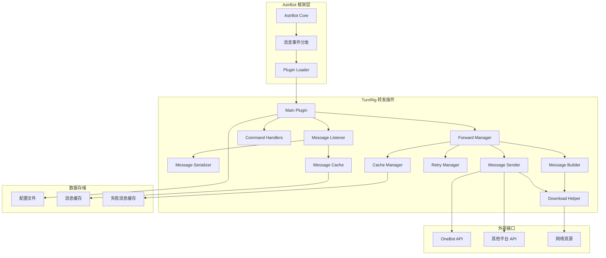
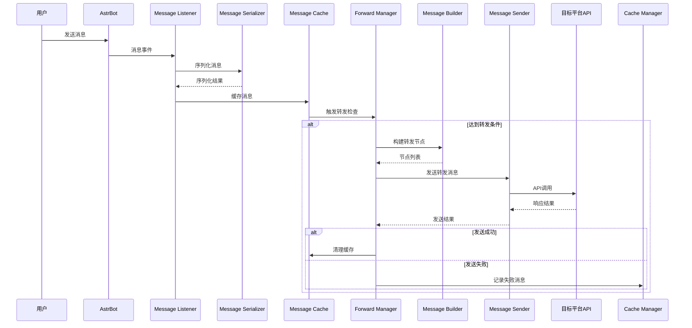
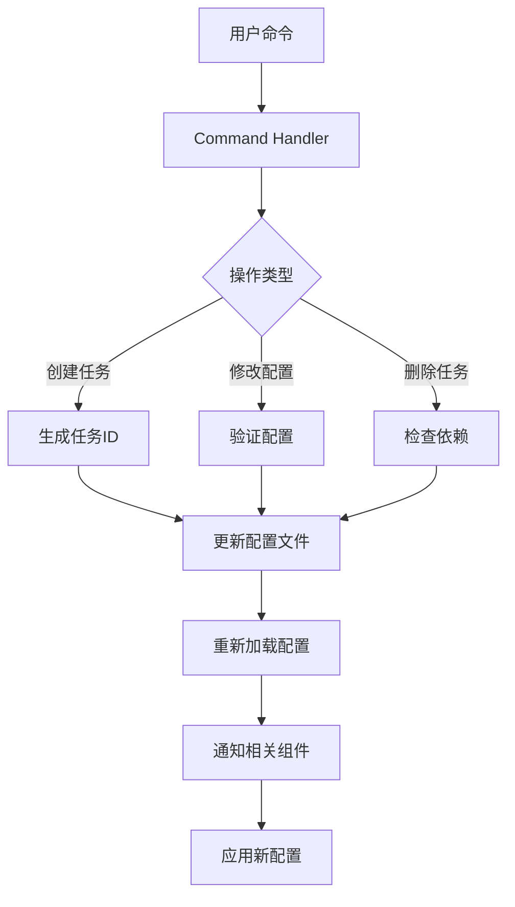

# 🎯 设计概览

欢迎了解 **Turnrig** 插件的整体设计理念和架构思想 这里会带你深入理解插件的核心设计！

## 🌟 设计理念

### 核心目标

**Turnrig** 插件旨在为 `AstrBot` 提供强大而灵活的消息转发能力，让不同会话之间的消息能够自由流动

1. **🔄 智能转发**: 基于规则自动转发消息，支持多种监听和转发模式
2. **🛡️ 稳定可靠**: 具备完善的错误处理和重试机制
3. **⚡ 高性能**: 优化的异步处理和缓存策略
4. **🎨 易用性**: 简洁直观的配置和管理界面
5. **🔧 可扩展**: 模块化设计，支持功能扩展

### 设计原则

#### 1. 模块化设计 🧩
- 每个功能模块职责单一，相互解耦
- 便于测试、维护和功能扩展
- 支持插件式功能增强

#### 2. 异步优先 ⚡
- 全异步事件处理，避免阻塞
- 并发处理多个转发任务
- 优化系统响应性能

#### 3. 容错设计 🛡️
- 多层错误处理机制
- 自动重试和降级策略
- 优雅的故障恢复

#### 4. 数据驱动 📊
- 基于配置文件的规则定义
- 运行时配置热加载
- 数据与逻辑分离

## 🏗️ 整体架构

### 系统架构图

> [!TIP]
> 该图可能是不准确的。



### 分层架构

#### 接口层 (Interface Layer)
- **Command Handlers**: 处理用户命令和管理操作
- **Message Listener**: 监听和预处理所有消息事件
- **API Adapters**: 与外部平台API交互

#### 业务层 (Business Layer)  
- **Forward Manager**: 转发逻辑协调和管理
- **Message Builder**: 消息格式构建和转换
- **Message Sender**: 多平台消息发送处理
- **Configuration Manager**: 配置管理和验证

#### 服务层 (Service Layer)
- **Cache Manager**: 缓存数据管理
- **Retry Manager**: 重试机制实现
- **Download Helper**: 媒体文件处理
- **Message Serializer**: 消息序列化处理

#### 数据层 (Data Layer)
- **配置存储**: JSON格式的任务配置
- **消息缓存**: 内存中的消息临时存储
- **失败重试缓存**: 持久化的重试数据

## 🔄 数据流架构

### 消息处理流程

> [!TIP]
> 该图可能是不准确的。



### 配置管理流程

> [!TIP]
> 该图可能是不准确的。



## 📦 组件职责划分

### 核心组件

#### Main Plugin 🎮
- **职责**: 插件生命周期管理，组件协调
- **接口**: AstrBot插件标准接口
- **依赖**: 所有子组件

#### Message Listener 👂
- **职责**: 消息事件监听，过滤和预处理
- **接口**: AstrBot事件监听器
- **依赖**: Message Serializer, Message Cache

#### Forward Manager 📤
- **职责**: 转发逻辑协调，流程控制
- **接口**: 转发触发和状态管理
- **依赖**: Message Builder, Message Sender, Cache Manager

### 辅助组件

#### Message Builder 🏗️
- **职责**: 消息格式转换，节点构建
- **接口**: 节点构建API
- **依赖**: Download Helper

#### Message Sender 📡
- **职责**: 多平台消息发送，API调用
- **接口**: 发送方法和状态查询
- **依赖**: Download Helper

#### Cache Manager 💾
- **职责**: 缓存数据管理，持久化
- **接口**: 缓存操作API
- **依赖**: 文件系统

## 🔌 扩展性设计

### 插件化架构

```python
class ForwardPlugin:
    """可扩展的转发插件基类"""
    
    def __init__(self):
        self.handlers = {}
        self.filters = {}
        
    def register_handler(self, message_type: str, handler: callable):
        """注册消息类型处理器"""
        
    def register_filter(self, filter_name: str, filter_func: callable):
        """注册消息过滤器"""
        
    def load_extension(self, extension_path: str):
        """动态加载扩展模块"""
```

### 平台适配器

```python
class PlatformAdapter:
    """平台适配器基类"""
    
    async def send_message(self, target: str, content: dict) -> bool:
        """发送消息到特定平台"""
        raise NotImplementedError
        
    async def download_media(self, url: str) -> str:
        """下载媒体文件"""
        raise NotImplementedError
        
class QQAdapter(PlatformAdapter):
    """QQ平台适配器"""
    
class TelegramAdapter(PlatformAdapter):
    """Telegram平台适配器"""
```

## 🚀 性能优化策略

### 异步处理优化

1. **并发控制**: 使用信号量限制并发操作数量
2. **批处理**: 合并多个消息的处理操作
3. **流水线**: 消息处理流水线化，提高吞吐量

### 缓存策略

1. **多级缓存**: 内存缓存 + 文件缓存 + 网络缓存
2. **智能清理**: 基于时间和空间的缓存清理策略
3. **预加载**: 常用数据预加载到内存

### 资源管理

1. **连接池**: 复用网络连接，减少连接开销
2. **文件清理**: 定期清理临时文件，避免磁盘空间浪费
3. **内存优化**: 及时释放不需要的对象引用

## 🛡️ 安全性设计

### 数据安全

1. **配置加密**: 敏感配置信息加密存储
2. **权限控制**: 基于用户角色的操作权限控制
3. **数据验证**: 所有输入数据严格验证

### 运行时安全

1. **沙箱执行**: 隔离插件执行环境
2. **资源限制**: 限制插件使用的系统资源
3. **异常隔离**: 防止插件异常影响主程序

### 网络安全

1. **HTTPS强制**: 所有网络请求使用HTTPS
2. **证书验证**: 验证服务器证书有效性
3. **请求限流**: 防止恶意请求攻击

## 📊 监控和诊断

### 性能指标

```python
class PerformanceMetrics:
    """性能指标收集器"""
    
    def __init__(self):
        self.message_count = 0
        self.forward_success_rate = 0.0
        self.average_latency = 0.0
        self.cache_hit_rate = 0.0
        
    def record_message_processed(self):
        """记录消息处理"""
        
    def record_forward_result(self, success: bool, latency: float):
        """记录转发结果"""
        
    def get_summary(self) -> dict:
        """获取性能摘要"""
```

### 日志系统

1. **分级日志**: DEBUG/INFO/WARNING/ERROR四级日志
2. **结构化日志**: JSON格式的结构化日志输出
3. **日志轮转**: 自动日志文件轮转和清理

### 健康检查

```python
class HealthChecker:
    """健康状态检查器"""
    
    async def check_component_health(self) -> dict:
        """检查各组件健康状态"""
        return {
            "message_listener": "healthy",
            "forward_manager": "healthy", 
            "cache_manager": "healthy",
            "overall_status": "healthy"
        }
```

---

这个设计概览展现了插件的完整架构思想，为后续的开发和维护提供了清晰的指导方向 ✨

如需了解具体组件的详细设计，请查看 [组件设计](component-design.md) 和 [数据流图](message-flow.md) 文档！ 
